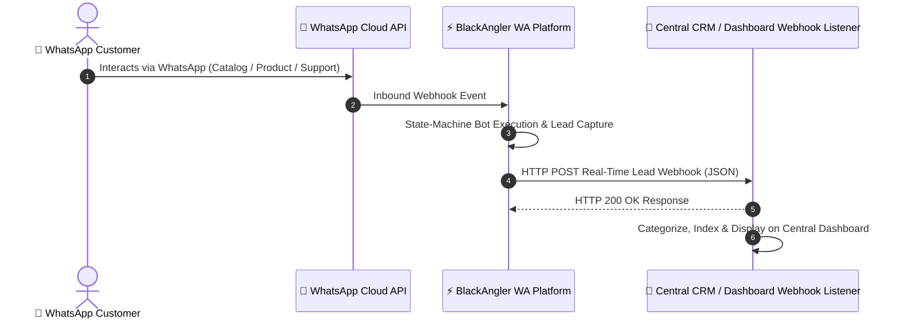

# 📡 BlackAngler WA — Outbound CRM Lead Webhook Integration Guide

> [!IMPORTANT]
> **Developer Documentation Notice**
> This document specifies the real-time **Outbound CRM Lead Webhook** data contract dispatched by the **BlackAngler WA WhatsApp Platform**. Use this technical reference to build, categorize, sort, and store incoming leads and enquiries on your central CRM / Dashboard.

---

## 🎯 Executive Overview

Whenever a customer interacts with the **BlackAngler WA** WhatsApp Bot or submits an inquiry, the platform automatically dispatches a real-time HTTP `POST` JSON request to your configured **Central Dashboard Leads Webhook URL**.



---

## ⚙️ HTTP Protocol & Connection Standards

| Property | Value | Description |
| :--- | :--- | :--- |
| **HTTP Method** | `POST` | All webhook events are dispatched as HTTP `POST` requests |
| **Content-Type** | `application/json` | Payloads are serialized in standard JSON format |
| **User-Agent** | `BlackAngler-WhatsApp-CRM-Webhook/1.0` | Custom header for easy firewall & route filtering |
| **Timeout Allowance** | `8.0 seconds` | Expected response time from your CRM server |
| **Timezone Standard** | `UTC (ISO 8601)` | All `createdAt` timestamps are formatted in ISO 8601 UTC |

> [!TIP]
> **Performance Recommendation**  
> Your CRM webhook endpoint should return an `HTTP 200 OK` response immediately after validating the JSON payload, and queue heavy background jobs (e.g. sending emails or SMS) asynchronously.

---

## 🔑 Common Payload Schema (Root Fields)

Every payload contains standardized top-level keys allowing instant filtering, tenant mapping, and chronological sorting:

```typescript
interface LeadWebhookPayload {
  event: 'lead.catalog_inquiry' | 'lead.product_inquiry' | 'lead.support_request';
  inquiryType: 'catalog_inquiry' | 'product_inquiry' | 'support_request';
  businessType: 'wholesale' | 'ecommerce';
  channel: 'whatsapp_wholesale';
  leadId: string;         // Unique MongoDB Lead ID
  customer: {
    name: string;        // Customer Name or WhatsApp Display Name
    phone: string;       // E.164 Formatted Phone Number (e.g. "+918625067058")
  };
  inquiry: Record<string, any>; // Specific inquiry details object
  status: 'New' | 'Pending' | 'Open' | 'Closed';
  createdAt: string;     // ISO 8601 Timestamp e.g. "2026-08-07T11:40:00.000Z"
  tenantId: string;      // Tenant / Business Account ID
}
```

---

## 📑 Specification of the 3 Interaction Flows

The platform captures **3 distinct types of customer interactions**. Each type is identified by `inquiryType` and `event`.

---

### Flow 1: Catalog Inquiry (`inquiryType: "catalog_inquiry"`)

> [!NOTE]
> **Trigger Condition**: Customer taps **"View Catalog"** in WhatsApp to browse products or request digital catalog PDFs.

#### **JSON Payload Example**
```json
{
  "event": "lead.catalog_inquiry",
  "inquiryType": "catalog_inquiry",
  "businessType": "wholesale",
  "channel": "whatsapp_wholesale",
  "leadId": "66b3f8a9e1234567890abcde",
  "customer": {
    "name": "Ram Rajurkar",
    "phone": "+918625067058"
  },
  "inquiry": {
    "category": "Catalog View",
    "catalogUrl": "http://localhost/uploads/menu/Summer_Collection_2026.pdf",
    "notes": "Customer requested digital fabric & design catalog via WhatsApp"
  },
  "status": "New",
  "createdAt": "2026-08-07T11:40:00.000Z",
  "tenantId": "66b1a2b3c4d5e6f7a8b9c0d1"
}
```

---

### Flow 2: Product Wholesale Inquiry (`inquiryType: "product_inquiry"`)

> [!NOTE]
> **Trigger Condition**: Customer taps **"Product Enquiry"** and completes an automated wholesale order form (style codes, quantity range, requirements).

#### **JSON Payload Example**
```json
{
  "event": "lead.product_inquiry",
  "inquiryType": "product_inquiry",
  "businessType": "wholesale",
  "channel": "whatsapp_wholesale",
  "leadId": "66b3f8a9e1234567890abcdf",
  "customer": {
    "name": "Ram Rajurkar",
    "phone": "+918625067058"
  },
  "inquiry": {
    "category": "Product Wholesale Order",
    "productName": "Wholesale Cotton Suit",
    "styleCode": "COTTON-104",
    "quantityRange": "500 meters",
    "requirements": "Need reactive dyeing with custom label packaging"
  },
  "status": "Pending",
  "createdAt": "2026-08-07T11:41:00.000Z",
  "tenantId": "66b1a2b3c4d5e6f7a8b9c0d1"
}
```

---

### Flow 3: Talk to Our Team (`inquiryType: "support_request"`)

> [!NOTE]
> **Trigger Condition**: Customer taps **"Talk to Our Team"** to request direct contact with a human sales representative or support executive.

#### **JSON Payload Example**
```json
{
  "event": "lead.support_request",
  "inquiryType": "support_request",
  "businessType": "wholesale",
  "channel": "whatsapp_wholesale",
  "leadId": "66b3f8a9e1234567890abcdg",
  "customer": {
    "name": "Ram Rajurkar",
    "phone": "+918625067058"
  },
  "inquiry": {
    "category": "Customer Support & Direct Contact",
    "supportTopic": "Human Sales Representative Needed",
    "issueDescription": "Customer requested to speak with sales representative regarding bulk orders",
    "priority": "High"
  },
  "status": "Open",
  "createdAt": "2026-08-07T11:42:00.000Z",
  "tenantId": "66b1a2b3c4d5e6f7a8b9c0d1"
}
```

---

## 📊 Categorizing, Filtering & Chronological Sorting Rules

To properly index and categorize incoming leads on your Central CRM Dashboard:

### 1. Categorization Rules (`inquiryType` & `businessType`)
- **By Inquiry Type**:
  - `catalog_inquiry` ➔ Route to **Catalog Downloads & Views Tab**.
  - `product_inquiry` ➔ Route to **High-Value Wholesale Sales Pipeline**.
  - `support_request` ➔ Route to **Customer Service Helpdesk Queue**.
- **By Business Channel**:
  - Filter using `payload.businessType === "wholesale"` to separate wholesale buyers from ecommerce retail clients.

### 2. Chronological Sorting & Deduplication (`createdAt` & `leadId`)
- Store `leadId` as a `UNIQUE` index in your database to avoid duplicate records.
- Parse `createdAt` into a Date object and index `createdAt DESC` to display the newest leads at the top of your dashboard.

### 3. Recommended CRM Database Indexing
```sql
-- SQL Indexing Strategy
CREATE UNIQUE INDEX idx_leads_lead_id ON crm_leads (lead_id);
CREATE INDEX idx_leads_categorization ON crm_leads (tenant_id, business_type, inquiry_type, created_at DESC);
```
```javascript
// MongoDB Indexing Strategy
db.crm_leads.createIndex({ leadId: 1 }, { unique: true });
db.crm_leads.createIndex({ tenantId: 1, businessType: 1, inquiryType: 1, createdAt: -1 });
```

---

## 💻 CRM Webhook Listener Server Code Implementation Examples

### **Node.js (Express & TypeScript)**

```typescript
import express, { Request, Response } from 'express';

const app = express();
app.use(express.json());

app.post('/api/webhooks/whatsapp-leads', async (req: Request, res: Response) => {
  try {
    const payload = req.body;
    console.log(`📥 Received Webhook Event: ${payload.event} (${payload.inquiryType})`);

    const { leadId, inquiryType, businessType, customer, inquiry, createdAt, tenantId } = payload;

    // 1. Process based on inquiry type
    switch (inquiryType) {
      case 'catalog_inquiry':
        console.log(`📖 Catalog View by ${customer.name} (${customer.phone}) -> ${inquiry.catalogUrl}`);
        // Insert into CRM Catalog Downloads Table
        break;

      case 'product_inquiry':
        console.log(`💰 Wholesale Inquiry for ${inquiry.styleCode} (${inquiry.quantityRange})`);
        // Insert into CRM Sales Pipeline
        break;

      case 'support_request':
        console.log(`🚨 Support Request from ${customer.phone}: ${inquiry.issueDescription}`);
        // Create High-Priority Support Ticket
        break;
    }

    // 2. Return HTTP 200 OK immediately
    return res.status(200).json({
      success: true,
      message: 'Lead received and processed successfully',
      leadId: leadId
    });

  } catch (error: any) {
    console.error('❌ Webhook Handler Error:', error);
    return res.status(500).json({ success: false, error: error.message });
  }
});

app.listen(8080, () => console.log('🚀 CRM Webhook Listener active on port 8080'));
```

---

### **Python (FastAPI)**

```python
from fastapi import FastAPI, Request, HTTPException
from fastapi.responses import JSONResponse
import logging

app = FastAPI(title="CRM Webhook Listener")
logging.basicConfig(level=logging.INFO)

@app.post("/api/webhooks/whatsapp-leads")
async def handle_whatsapp_lead_webhook(request: Request):
    try:
        payload = await request.json()
        event = payload.get("event")
        inquiry_type = payload.get("inquiryType")
        customer = payload.get("customer", {})
        inquiry = payload.get("inquiry", {})
        
        logging.info(f"📥 Received Webhook Event: {event} | Inquiry Type: {inquiry_type}")

        if inquiry_type == "catalog_inquiry":
            # Process Catalog Download / View
            logging.info(f"📖 Catalog View: {customer.get('name')} ({customer.get('phone')})")

        elif inquiry_type == "product_inquiry":
            # Process Wholesale Product Inquiry
            logging.info(f"💰 Wholesale Order: Code {inquiry.get('styleCode')} | Qty: {inquiry.get('quantityRange')}")

        elif inquiry_type == "support_request":
            # Process Customer Support Request
            logging.info(f"🚨 Support Request: {customer.get('phone')} | {inquiry.get('issueDescription')}")

        return JSONResponse(
            status_code=200,
            content={"success": True, "message": "Lead payload processed successfully"}
        )

    except Exception as e:
        logging.error(f"❌ Error processing webhook: {e}")
        raise HTTPException(status_code=500, detail=str(e))
```

---

## 📥 Required Webhook Response Format

Your CRM server MUST respond with an `HTTP 200 OK` or `201 Created` status code within 8.0 seconds:

```json
{
  "success": true,
  "message": "Lead received and logged in CRM database",
  "leadId": "66b3f8a9e1234567890abcde"
}
```

---

### 🛠️ Live Testing Instructions
1. Navigate to **[Settings](http://localhost/settings)**.
2. Enter your listening server URL (or `https://webhook.site/your-id`).
3. Click **`🧪 Send Test Webhook Payload`** to trigger live test dispatches.
