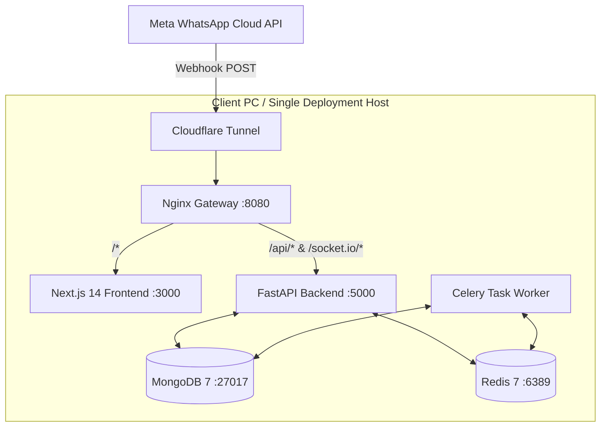
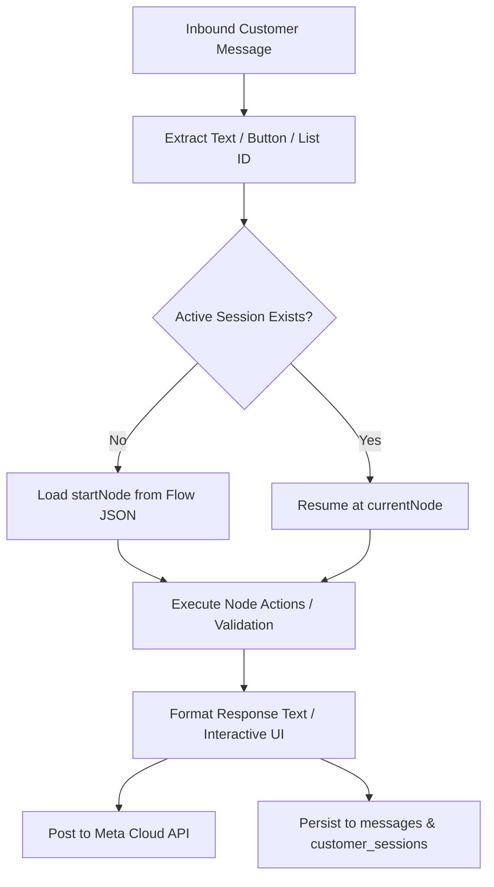

# 📋 WhatsApp Automation Platform — Comprehensive Architecture & Tenancy Audit Report

> **Date:** September 2026  
> **Target System:** WhatsApp Marketing & Automation Platform (`RestoChat` / `BlackAngler Wholesale`)  
> **Document Status:** Production Architectural Audit & Tenancy Assessment

---

## 📑 Table of Contents

1. [Executive Summary & Classification](#1-executive-summary--classification)
2. [Deployment Topology Analysis](#2-deployment-topology-analysis)
3. [Tenant Isolation & Data Scoping Audit](#3-tenant-isolation--data-scoping-audit)
4. [Hardcoded Values & Client-Specific Leakages](#4-hardcoded-values--client-specific-leakages)
5. [Configuration, Secrets & Meta Credentials Management](#5-configuration-secrets--meta-credentials-management)
6. [Scaling, Background Processing & Shared Infrastructure](#6-scaling-background-processing--shared-infrastructure)
7. [Chatbot Engine & Conversational Flow Architecture](#7-chatbot-engine--conversational-flow-architecture)
8. [Gap Analysis & Roadmap to True Multi-Tenant SaaS](#8-gap-analysis--roadmap-to-true-multi-tenant-saas)

---

## 1. Executive Summary & Classification

### Architecture Classification
**Classification: (d) Hybrid / Transitional**  
*(Operationally **Single-Tenant-per-Container**, containing artifacts of a **Single-Tenant-per-Fork**, with incomplete scaffolding for **True Multi-Tenant SaaS**).*

```
┌─────────────────────────────────────────────────────────────────────────────┐
│                           CURRENT STATE TAXONOMY                            │
├──────────────────────────┬──────────────────────────────────────────────────┤
│ Runtime Model            │ Single-Tenant-per-Container (Isolated PC Stack) │
│ Database Model           │ Dedicated Database per Container Instance        │
│ Codebase State           │ Hybrid Fork with Client-Specific Seeds/Logic     │
│ Multi-Tenancy Readiness  │ Incomplete / Prototype Scaffolding (`APP_MODE`) │
└──────────────────────────┴──────────────────────────────────────────────────┘
```

### Key Audit Findings
1. **Per-Client Containerized Stack:** The platform is engineered and packaged as a self-contained local stack deployed on individual client hardware (e.g., Windows PC at a store or restaurant).
2. **Missing Database-Level Isolation:** There is no generic `TenantScopedRepository` layer. Queries in primary modules (such as chat conversations and messages) do not filter by `tenant_id`.
3. **Dual-Layered Meta Credentials:** WhatsApp Cloud API credentials default to environment variables (`.env`) with optional database overrides saved on the user profile document.
4. **Client-Specific Code Leakage:** Hardcoded client references (*Rathod Creation*, *BlackAngler*), phone numbers, bank details, and bespoke routing logic are embedded inside route handlers, seed files, and UI components.
5. **Data-Driven Chatbot State Machine:** The conversational flow system is dynamic and JSON-driven rather than hardcoded Python flow classes, facilitating a future transition to SaaS once database multi-tenancy is established.

---

## 2. Deployment Topology Analysis

### 2.1 Container Topology
The platform utilizes Docker Compose to run a full multi-service stack per deployment target.

* **Compose Definition:** [`docker-compose.yml`](file:///d:/New%20Whatsapp%20Platform/whatsapp_marketing_solution/docker-compose.yml)
* **Services Deployed:**
  1. `mongodb` (`mongo:7`): Standalone document database with WiredTiger cache limited to `0.25GB` for low-resource PC constraints.
  2. `redis` (`redis:7-alpine`): In-memory cache, task queue broker, and Socket.IO pub/sub bus.
  3. `backend` (`python_backend/Dockerfile`): Python 3.13 / FastAPI REST API, WebSocket server, and Meta webhook receiver.
  4. `worker` (`python_backend/Dockerfile`): Celery worker running 4 concurrent task execution threads.
  5. `frontend` (`frontend/Dockerfile`): Next.js 14 standalone Progressive Web App (PWA).
  6. `nginx` (`nginx:alpine`): Reverse proxy on port `8080`/`80` routing `/api/`, `/uploads/`, `/socket.io/`, and `/`.
  7. `cloudflared` (`cloudflare/cloudflared:latest`): Ingress tunnel establishing an encrypted HTTPS route to Meta without port forwarding.



### 2.2 Database Topology & Connection Configurations
* **Database Connection Strategy:** Environment-scoped single database.
* **Supporting Configurations:**
  * [`python_backend/app/config.py`](file:///d:/New%20Whatsapp%20Platform/whatsapp_marketing_solution/python_backend/app/config.py#L7-L8):
    ```python
    MONGODB_URI: str = "mongodb://localhost:27017"
    DB_NAME: str = "resto_chat"
    ```
  * [`docker-compose.yml`](file:///d:/New%20Whatsapp%20Platform/whatsapp_marketing_solution/docker-compose.yml#L12): Sets `MONGO_INITDB_DATABASE: whatsapp_saas` and injects `DB_NAME: whatsapp_saas` into both `backend` and `worker`.
  * [`python_backend/app/database.py`](file:///d:/New%20Whatsapp%20Platform/whatsapp_marketing_solution/python_backend/app/database.py#L13-L14): Instantiates `AsyncIOMotorClient(settings.MONGODB_URI)` bound directly to `settings.DB_NAME`.

### 2.3 Deployment Automation & Distribution
* **Pendrive / Local Installer Script:** [`setup.bat`](file:///d:/New%20Whatsapp%20Platform/whatsapp_marketing_solution/setup.bat)
  * Installs Docker Desktop if absent.
  * Copies code to `C:\RestoChat\`.
  * Prompts for client credentials (`RESTAURANT_NAME`, `WA_PHONE_ID`, `WA_BUSINESS_ID`, `WA_TOKEN`, `WA_VERIFY`).
  * Generates `C:\RestoChat\python_backend\.env`.
  * Registers Windows Task Scheduler task [`autostart.bat`](file:///d:/New%20Whatsapp%20Platform/whatsapp_marketing_solution/autostart.bat) to launch `docker-compose up -d` upon Windows login.
* **CI/CD Pipelines:** None present (no `.github/workflows`, `.gitlab-ci.yml`, or automated build agents exist in the codebase).

---

## 3. Tenant Isolation & Data Scoping Audit

### 3.1 `TenantScopedRepository` Status
* **Status:** **Not Implemented (Placeholder Checklist Item Only).**
* **Evidence:** In [`docs/FULL_FEATURE_CHECKLIST.md`](file:///d:/New%20Whatsapp%20Platform/whatsapp_marketing_solution/docs/FULL_FEATURE_CHECKLIST.md#L37), the requirement is noted as an incomplete migration objective:
  > `- [ ] Every tenant-scoped collection query is structurally required to declare a business_id up front (via TenantScopedRepository or equivalent)`

### 3.2 Tenant Utilities Implementation (`tenant.py`)
Tenant helpers are located in [`python_backend/app/utils/tenant.py`](file:///d:/New%20Whatsapp%20Platform/whatsapp_marketing_solution/python_backend/app/utils/tenant.py):

```python
def get_tenant_filter(current_user: dict) -> dict:
    if getattr(settings, "APP_MODE", "self_hosted") == "saas":
        tenant_id = str(current_user.get("_id"))
        return {"tenantId": tenant_id}
    return {}

def inject_tenant_id(doc: dict, current_user: dict) -> dict:
    if getattr(settings, "APP_MODE", "self_hosted") == "saas":
        tenant_id = str(current_user.get("_id"))
        doc["tenantId"] = tenant_id
    return doc
```

### 3.3 Collection-by-Collection Isolation Audit

| MongoDB Collection | Scoping Enforced? | Tenant Filter Utilized? | Vulnerability / Leakage Vector |
|---|:---:|---|---|
| `conversations` | ❌ **No** | None in [`conversations.py`](file:///d:/New%20Whatsapp%20Platform/whatsapp_marketing_solution/python_backend/app/routes/conversations.py#L46) | Any user can query, list, and read all customer conversations in the database. |
| `messages` | ❌ **No** | None in [`conversations.py`](file:///d:/New%20Whatsapp%20Platform/whatsapp_marketing_solution/python_backend/app/routes/conversations.py#L87) | All inbound/outbound chat history is accessible globally across the shared DB. |
| `customers` | ⚠️ **Partial** | Handled in [`customers.py`](file:///d:/New%20Whatsapp%20Platform/whatsapp_marketing_solution/python_backend/app/routes/customers.py#L46) | Scoped only when `APP_MODE == "saas"`. In default `self_hosted`, returns `{}`. |
| `broadcasts` | ⚠️ **Partial** | Handled in [`broadcasts.py`](file:///d:/New%20Whatsapp%20Platform/whatsapp_marketing_solution/python_backend/app/routes/broadcasts.py#L195) | Injected on insert; search/aggregation endpoints have inconsistent scoping. |
| `bot_flows` | ⚠️ **Partial** | Handled in [`bot_flow.py`](file:///d:/New%20Whatsapp%20Platform/whatsapp_marketing_solution/python_backend/app/routes/bot_flow.py#L88) | Defaults to singleton document in `self_hosted` mode. |
| `quick_replies` | ⚠️ **Partial** | Handled in [`quick_replies.py`](file:///d:/New%20Whatsapp%20Platform/whatsapp_marketing_solution/python_backend/app/routes/quick_replies.py#L33) | Scoped only if `APP_MODE == "saas"`. |
| `users` | ❌ **Single-Tenant** | Blocked in [`auth.py`](file:///d:/New%20Whatsapp%20Platform/whatsapp_marketing_solution/python_backend/app/routes/auth.py#L74) | Self-hosted mode actively prevents registering more than 1 user. |

---

## 4. Hardcoded Values & Client-Specific Leakages

The codebase contains several hardcoded brand names, phone numbers, banking information, and custom business logic:

### 4.1 Client References: "Rathod Creation" & "BlackAngler"
1. **Seed Data & Banking Details:** [`python_backend/app/routes/quick_replies.py`](file:///d:/New%20Whatsapp%20Platform/whatsapp_marketing_solution/python_backend/app/routes/quick_replies.py#L137-L150)
   ```python
   TEXTILE_REPLIES_SEED = [
       ...,
       {
           "title": "🏦 Official Bank Account Details",
           "category": "Payment & Terms",
           "body": "Account Name: Rathod Creation\nBank: HDFC Bank\nA/C No: 50200012345678\nIFSC Code: HDFC0001234\nUPI ID: rathodcreation@hdfcbank"
       },
       {
           "title": "📞 Wholesale Helpline & Assistance",
           "category": "General",
           "body": "Thank you for reaching out to Rathod Creation Wholesale! ... reach our direct wholesale desk at +91 98765 43210"
       }
   ]
   ```
2. **Mock Webhook Payload:** [`python_backend/app/routes/settings.py`](file:///d:/New%20Whatsapp%20Platform/whatsapp_marketing_solution/python_backend/app/routes/settings.py#L93-L96)
   ```python
   mock_lead = {
       "_id": f"simulated_{inq_type}_9999",
       "customerName": "Test Customer (Rathod Creation)",
       "customerPhone": "918625067058",
       "productName": "Silk Designer Saree",
       "styleCode": "RC-SAREE-902",
       ...
   }
   ```
3. **Hardcoded Support URL & Phone:** [`frontend/src/components/Sidebar.tsx`](file:///d:/New%20Whatsapp%20Platform/whatsapp_marketing_solution/frontend/src/components/Sidebar.tsx#L202)
   ```typescript
   window.open(
     `https://wa.me/918625067058?text=${encodeURIComponent('Hello! I need assistance with BlackAngler WA WhatsApp Wholesale Platform.')}`,
     '_blank'
   );
   ```
4. **Chatbot Flow IDs:** [`python_backend/uploads/configs/active_chatbot_flow.json`](file:///d:/New%20Whatsapp%20Platform/whatsapp_marketing_solution/python_backend/uploads/configs/active_chatbot_flow.json#L2)
   ```json
   {
     "flowId": "rathod_wholesale_flow",
     "startNode": "node_language"
   }
   ```

### 4.2 Bespoke Domain Logic Branches
* [`python_backend/app/services/bot_executor.py`](file:///d:/New%20Whatsapp%20Platform/whatsapp_marketing_solution/python_backend/app/services/bot_executor.py#L191-L266):
  * Hardcoded domain logic checking `if "Wholesale Inquiry:" in ...` and extracting textile fields (`styleCode`, `quantityRange`).
  * E-commerce mock order tracking status branch (`action_type == "fetch_order_status"`) returning simulated delivery dates and tracking links.

---

## 5. Configuration, Secrets & Meta Credentials Management

### 5.1 Credential Resolution Flow
Meta WhatsApp Business API credentials follow a two-tier fallback model:

```
┌────────────────────────────────────────────────────────┐
│  Request Context / Operation (Send Message, Broadcast) │
└───────────────────────────┬────────────────────────────┘
                            │
                            ▼
     Does current_user document have custom WA credentials?
          ├── [YES] ──► Use user.waPhoneNumberId & user.waAccessToken
          └── [NO]  ──► Fall back to settings.WA_PHONE_NUMBER_ID / settings.WA_ACCESS_TOKEN
```

* **Configuration Schema:** [`python_backend/app/config.py`](file:///d:/New%20Whatsapp%20Platform/whatsapp_marketing_solution/python_backend/app/config.py#L12-L20)
  * `WA_PHONE_NUMBER_ID`, `WA_BUSINESS_ACCOUNT_ID`, `WA_ACCESS_TOKEN`, `WA_VERIFY_TOKEN`, `WA_APP_SECRET`, `WA_APP_ID`, `WA_API_VERSION`.
* **Dynamic Override Endpoint:** [`python_backend/app/routes/settings.py`](file:///d:/New%20Whatsapp%20Platform/whatsapp_marketing_solution/python_backend/app/routes/settings.py#L120-L150) saves updated credentials into `db.users`.

### 5.2 Runtime Tenant Context & Ingress Routing
* **JWT Claims:** [`python_backend/app/routes/auth.py`](file:///d:/New%20Whatsapp%20Platform/whatsapp_marketing_solution/python_backend/app/routes/auth.py#L43) creates tokens containing only `{"id": user_id_str}`. There are no organization or tenant claims.
* **Webhook Verification (GET Challenge):** [`python_backend/app/routes/webhook.py`](file:///d:/New%20Whatsapp%20Platform/whatsapp_marketing_solution/python_backend/app/routes/webhook.py#L74-L81) uses `db.db.users.find_one({})` — verifying against only the first user record in the system.
* **Inbound Message Resolution (POST):**
  * `resolve_webhook_tenant()` in [`tenant.py`](file:///d:/New%20Whatsapp%20Platform/whatsapp_marketing_solution/python_backend/app/utils/tenant.py#L25-L43) queries `db.users` by `waPhoneNumberId`, but only executes if `settings.APP_MODE == "saas"`. In `self_hosted` mode, `tenant_id` is set to `None`.

---

## 6. Scaling, Background Processing & Shared Infrastructure

### 6.1 Celery Task Workers
* **Task Setup:** [`python_backend/app/celery_app.py`](file:///d:/New%20Whatsapp%20Platform/whatsapp_marketing_solution/python_backend/app/celery_app.py)
  * Concurrency: 4 workers per process (`worker_concurrency=4`).
  * Process recycling: `worker_max_memory_per_child=200_000` (recycles workers after 200MB to prevent leaks on constrained hardware).
  * Prefetch: `worker_prefetch_multiplier=1` (prevents task hoarding).
  * Late Acknowledgement: `task_acks_late=True` ensuring crash-safe replay.
* **Queuing Model:** Single default queue on Redis; no per-tenant worker pools or fair-share rate schedulers.

### 6.2 Redis Usage
* **Instance:** Standalone container `wa_redis` (`redis:7-alpine`) on internal bridge network `wa_network`.
* **Roles:**
  1. Celery message broker and result backend (`redis://redis:6379/0`).
  2. Python-SocketIO async pub/sub manager for multi-process event emission from Celery workers back to FastAPI.
  3. Caching layer for token bucket rate limits ([`rate_limiter.py`](file:///d:/New%20Whatsapp%20Platform/whatsapp_marketing_solution/python_backend/app/utils/rate_limiter.py)).

---

## 7. Chatbot Engine & Conversational Flow Architecture

### 7.1 Architecture Pattern
* **Pattern:** Generic JSON State Machine Interpreter.
* **Engine File:** [`python_backend/app/services/bot_executor.py`](file:///d:/New%20Whatsapp%20Platform/whatsapp_marketing_solution/python_backend/app/services/bot_executor.py)
* **Flow Route:** [`python_backend/app/routes/bot_flow.py`](file:///d:/New%20Whatsapp%20Platform/whatsapp_marketing_solution/python_backend/app/routes/bot_flow.py)



### 7.2 Node Execution Types Supported
1. `interactive_button`: Renders WhatsApp interactive button messages (up to 3 quick reply buttons).
2. `interactive_list`: Renders WhatsApp list pickers (sections + rows).
3. `collect_input`: Form input collector with schema validation (`number`, `phone`, `email`, `regex`).
4. `action_node`: Executes dynamic system actions (`create_lead_or_booking`, `fetch_order_status`, `create_support_ticket`, `send_menu`).
5. `text`: Standard text output with template placeholder interpolation (`{business_name}`, `{catalog_url}`, context variables).

### 7.3 Flow Storage Catalog

| Flow Identifier | Source File Location | Primary Business Domain |
|---|---|---|
| `rathod_wholesale_flow` | [`uploads/configs/active_chatbot_flow.json`](file:///d:/New%20Whatsapp%20Platform/whatsapp_marketing_solution/python_backend/uploads/configs/active_chatbot_flow.json) | Textile / Garment Wholesale & B2B |
| `ecommerce_retail_flow` | [`uploads/configs/active_chatbot_flow_ecommerce.json`](file:///d:/New%20Whatsapp%20Platform/whatsapp_marketing_solution/python_backend/uploads/configs/active_chatbot_flow_ecommerce.json) | D2C Apparel Retail & Order Tracking |
| `default_flow` | Hardcoded in [`bot_flow.py`](file:///d:/New%20Whatsapp%20Platform/whatsapp_marketing_solution/python_backend/app/routes/bot_flow.py#L25-L80) | Restaurant Table Reservations & Menu |

---

## 8. Gap Analysis & Roadmap to True Multi-Tenant SaaS

To transition from the current single-tenant-per-container model to a true Multi-Tenant SaaS architecture (shared application and database cluster), the following 5 migration phases are required:

```
┌─────────────────────────────────────────────────────────────────────────────┐
│                       MIGRATION ROADMAP TO TRUE SAAS                        │
├─────────────────────────────────────────────────────────────────────────────┤
│ Phase 1: Database-Enforced Data Scoping (`TenantScopedRepository`)         │
│ Phase 2: Multi-Tenant Authentication & Request Context Middleware          │
│ Phase 3: Dynamic Webhook Ingress & Verification Routing                    │
│ Phase 4: Shared Worker Infrastructure & Fair-Share Scheduling              │
│ Phase 5: Complete Decoupling of Client Content & Branding                  │
└─────────────────────────────────────────────────────────────────────────────┘
```

### Phase 1: Implement `TenantScopedRepository` Pattern
* **Objective:** Ensure no raw database query can execute without an explicit `tenant_id` constraint.
* **Actions:**
  1. Replace direct `db.db.collection.find()` calls with an encapsulated repository layer.
  2. Add compound indexes on `{ "tenantId": 1, ... }` across `conversations`, `messages`, `customers`, `broadcasts`, `bot_flows`, and `quick_replies`.
  3. Ensure [`conversations.py`](file:///d:/New%20Whatsapp%20Platform/whatsapp_marketing_solution/python_backend/app/routes/conversations.py) strictly validates that the requested `conversation_id` belongs to the requesting tenant before returning messages or sending replies.

### Phase 2: Multi-Tenant Auth & Context Middleware
* **Objective:** Enable multi-tenant user authentication, multiple team members per tenant, and automatic request scoping.
* **Actions:**
  1. Update JWT token generation in [`auth.py`](file:///d:/New%20Whatsapp%20Platform/whatsapp_marketing_solution/python_backend/app/routes/auth.py) to include `{"userId": "...", "tenantId": "..."}`.
  2. Implement a FastAPI dependency (`get_tenant_context`) that extracts `tenantId` from JWT claims or headers (`X-Tenant-ID`) and attaches it to `request.state`.
  3. Lift the registration restriction in [`auth.py`](file:///d:/New%20Whatsapp%20Platform/whatsapp_marketing_solution/python_backend/app/routes/auth.py#L72-L76) to allow multi-tenant sign-ups and organization invitations.

### Phase 3: Dynamic Webhook Ingress & Multi-WABA Routing
* **Objective:** Route incoming Meta webhooks to the appropriate tenant in real-time.
* **Actions:**
  1. Update `verify_webhook` (GET) in [`webhook.py`](file:///d:/New%20Whatsapp%20Platform/whatsapp_marketing_solution/python_backend/app/routes/webhook.py#L67-L86) to support path-based or parameter-based verify tokens (e.g., `/api/webhook/{tenant_id}` or token lookups across all registered tenants).
  2. Implement per-tenant HMAC signature validation (`X-Hub-Signature-256`) using the specific tenant's `WA_APP_SECRET`.
  3. Enable `resolve_webhook_tenant()` permanently (independent of `APP_MODE`).

### Phase 4: Shared Worker Queues & Fair-Share Rate Limiting
* **Objective:** Prevent high-volume broadcast campaigns from one tenant from starving other tenants of worker threads.
* **Actions:**
  1. Implement tenant-partitioned Celery queues or a weighted priority scheduler.
  2. Enforce per-tenant token-bucket rate limits in Redis (`tenant:{id}:rate_limit`) matching each client's specific Meta Tier (Tier 1: 1k/day, Tier 2: 10k/day, Tier 3: 100k/day).

### Phase 5: Client Content Decoupling & UI White-Labeling
* **Objective:** Remove all hardcoded business names, banking coordinates, and support links from backend source files and frontend code.
* **Actions:**
  1. Remove hardcoded seeds from [`quick_replies.py`](file:///d:/New%20Whatsapp%20Platform/whatsapp_marketing_solution/python_backend/app/routes/quick_replies.py) and move template seeding to tenant-configurable database fixtures.
  2. Refactor [`Sidebar.tsx`](file:///d:/New%20Whatsapp%20Platform/whatsapp_marketing_solution/frontend/src/components/Sidebar.tsx) to read support contact numbers and platform branding dynamically from `GET /api/settings`.
  3. Migrate all chatbot flow definitions out of static JSON files in `uploads/configs/` into tenant-scoped MongoDB documents manageable via a visual flow builder.

---
*Report compiled automatically from codebase audit.*
