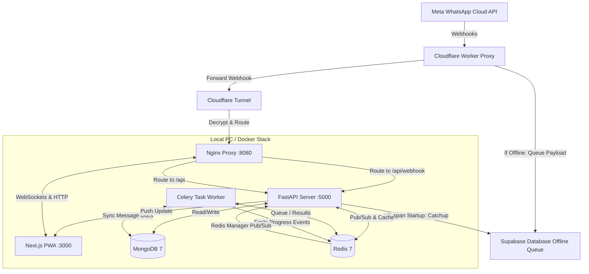

# 🏗️ RestoChat Architecture & Tech Stack Documentation

This document provides a detailed overview of the system architecture, network topology, service components, and technology stack powering the **RestoChat WhatsApp Marketing Solution**.

---

## 🗺️ High-Level System Architecture

RestoChat is designed as a **self-hosted, single-tenant SaaS application** optimized to run locally on a client's PC (e.g., a Windows machine at a restaurant or shop) or resource-constrained devices (like a Raspberry Pi), removing the need for expensive, dedicated cloud servers. 



---

## 🛠️ Service Components & Roles

The system is containerized using **Docker Compose** into seven modular, decoupled services:

### 1. Nginx Gateway (`nginx`)
*   **Role**: Reverse Proxy & Gateway.
*   **Port**: Binds internally to container network; exposes external port `8080` (or configured ports like port `80`).
*   **Responsibility**:
    *   Acts as the single point of entry for the containerized stack.
    *   Proxies frontend UI requests (`/`) to the Next.js service.
    *   Proxies API requests (`/api/*`) and WebSockets (`/socket.io/*`) to the FastAPI backend.
    *   Enforces basic request redirection and ensures CORS rules are satisfied consistently.

### 2. Next.js Frontend (`frontend`)
*   **Role**: Interactive PWA UI.
*   **Tech Stack**: Next.js 14 (App Router), React, TypeScript, Tailwind CSS, Lucide Icons, Zustand (State Management).
*   **Port**: Internal port `3000`.
*   **Key Operations**:
    *   Builds into a lightweight standalone Node server to minimize RAM overhead.
    *   Implements **Progressive Web App (PWA)** capabilities, allowing the dashboard to be installed directly on mobile/desktop browsers.
    *   Includes a boot-aware splash screen that polls `/api/health` to confirm the backend database is active before routing users into the app.
    *   Maintains a real-time live WhatsApp Inbox with infinite scroll, quick replies, menu management, reservation views, dashboard metrics, and a virtual Chatbot Simulator.

### 3. FastAPI Backend (`backend`)
*   **Role**: Core REST API, WebSocket Host, and Webhook Handler.
*   **Tech Stack**: Python 3.10+, FastAPI, Motor (Async MongoDB Driver), Python-SocketIO, SlowAPI (Rate Limiter).
*   **Port**: Internal port `5000`.
*   **Key Operations**:
    *   Hosts WebSocket namespaces for real-time inbox synchronization and broadcast progress reporting.
    *   Validates Meta's webhook HMAC-SHA256 signatures when receiving messages.
    *   Drives the automated, rule-based chatbot state-machine (managing reservations and feedback triggers).
    *   Delegates heavy processing (like broadcast queueing) to the Celery worker via Redis.

### 4. Celery Worker (`worker`)
*   **Role**: Asynchronous Task Runner.
*   **Tech Stack**: Python Celery, HTTPX.
*   **Key Operations**:
    *   Spawns a separate process dedicated to executing batch broadcast campaigns to large tags of customers.
    *   Ensures that bulk message deliveries do not block FastAPI's thread pool or trigger HTTP request timeouts.
    *   Provides retry-on-failure safety mechanisms to recover from network disconnects or API limit issues mid-broadcast.
    *   Uses a Redis Socket.IO Manager to emit real-time percentage progress updates to connected clients.

### 5. Redis (`redis`)
*   **Role**: Message Broker, Task Queue, & Memory Store.
*   **Image**: `redis:7-alpine`.
*   **Key Operations**:
    *   Acts as Celery's message broker and result backend.
    *   Serves as python-socketio's pub/sub channel backend, allowing the Celery worker process to publish WebSocket messages back to the FastAPI main process, which forwards them to the client.
    *   Manages chatbot settings cache invalidations to reduce MongoDB lookup latency during rapid inbound chat cycles.

### 6. MongoDB (`mongodb`)
*   **Role**: Primary NoSQL Document Database.
*   **Image**: `mongo:7`.
*   **Key Operations**:
    *   Stores users, customer profiles, tags, conversations, single message documents, quick replies, PDF menu references, reservations, chatbot settings, FAQ sheets, and logged customer feedback.
    *   Configured with restricted cache sizes (`--wiredTigerCacheSizeGB 0.25`) to prevent RAM exhaustion on low-memory physical host machines.

### 7. Cloudflare Tunnel (`cloudflared`)
*   **Role**: Secure Webhook Ingress Tunnel.
*   **Image**: `cloudflare/cloudflared:latest`.
*   **Key Operations**:
    *   Exposes the local Nginx Gateway port safely to the internet under a permanent HTTPS domain without requiring port forwarding, static public IPs, or manual SSL certificate renewals.
    *   Ensures the Webhook proxy worker can route WhatsApp incoming API updates securely directly to the FastAPI server.

---

## ⚡ Technical Dependencies & Libraries

### Backend Dependencies (`requirements.txt`)
*   `fastapi` & `uvicorn[standard]`: Async ASGI server and API framework.
*   `motor`: Async driver for MongoDB, facilitating non-blocking queries.
*   `pydantic` & `pydantic-settings`: Enforces declarative data schemas and environment config parsing.
*   `python-jose[cryptography]` & `bcrypt`: Secures user login sessions with JWT and securely hashes passphrases.
*   `python-socketio`: Multi-room WebSocket communication for instant chat synchronization.
*   `slowapi` & `limits`: Provides IP-based rate limiting on sensitive authentication endpoints.
*   `celery[redis]`: Manages queued worker tasks with Redis brokers.
*   `httpx`: Standard client library for non-blocking HTTP requests to Meta's API endpoints.
*   `Pillow`: Used for image size evaluation and media preprocessing.
*   `pytz`: Localizes date objects (configured to `Asia/Kolkata` for precise operational logging).

### Frontend Dependencies (`package.json`)
*   `next`: Framework powering server-side rendering (SSR), middleware route protection, and dynamic builds.
*   `lucide-react`: Out-of-the-box premium dashboard iconography.
*   `zustand`: Sleek, minimal state management library tracking user authentication, cookies, and inbox status.
*   `socket.io-client`: Established socket client subscribing to immediate message changes.
*   `@tanstack/react-query`: Powerful data fetching, caching, and cache invalidation library syncing client states with the database.
*   `date-fns`: Date parsing and calendar calculation tools.

---

## 🛡️ Network Topology & Ingress Webhook Flow

```
                                  [ INTERNET ]
                                        │
             ┌──────────────────────────┴──────────────────────────┐
             ▼                                                     ▼
     [ Meta Cloud API ]                                     [ Admin/User PWA ]
             │                                                     │
             │ (Webhook Event)                                     │ (Dashboard View)
             ▼                                                     │
     ┌──────────────┐                                              │
     │ Cloudflare   │                                              │
     │ Worker Proxy │                                              │
     └──────┬───────┘                                              │
            │ (Forward HTTP POST)                                  │
            ▼                                                      ▼
     ┌──────────────┐                                      ┌──────────────┐
     │  Cloudflare  │                                      │  Public SSL  │
     │  Edge Tunnel │                                      │  DNS Domain  │
     └──────┬───────┘                                      └──────┬───────┘
            │                                                     │
            └──────────────────────────┬──────────────────────────┘
                                       │ (Decrypted local packet)
                                       ▼
                              [ C:\RestoChat Host ]
                              ┌───────────────────┐
                              │ Nginx (:8080/:80) │
                              └────────┬──────────┘
                                       │
                        ┌──────────────┴──────────────┐
                        ▼                             ▼
               [ Next.js (:3000) ]           [ FastAPI (:5000) ]
```

1.  **Ingress Origin**: Inbound updates begin at Meta's WhatsApp servers when a customer sends a message or a message status changes (sent, delivered, read).
2.  **Edge Routing**: The webhook is sent to the Cloudflare Worker URL.
3.  **worker.js Middleware**:
    *   Attempts to forward the webhook payload to the local Cloudflare Tunnel domain (`BACKEND_WEBHOOK_URL`).
    *   If the PC is online and running, the local Nginx container accepts, routes to FastAPI, and returns a `200 OK` which the worker reflects.
    *   If the PC is offline, the worker intercepts the failure, writes the payload to Supabase Database storage, and still returns a `200 EVENT_RECEIVED` to Meta to prevent hook revocation.
4.  **Local Resolution**: On the local PC, the Cloudflare tunnel client processes incoming requests internally, forwarding decrypted packets to Nginx on port `8080`, which proxies `/api/webhook` traffic straight into FastAPI running on port `5000`.
