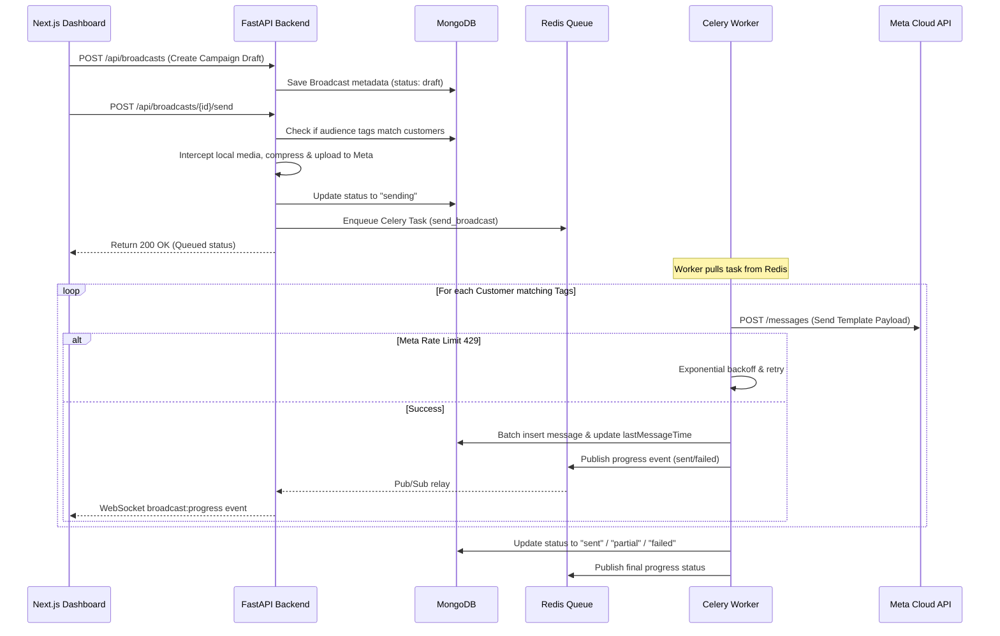

# 🎯 RestoChat Business Logic & Functional Scope

This document details the functional capabilities, business workflows, chatbot flows, campaign management logic, target audience, and platform scope of **RestoChat**.

---

## 📈 Platform Scope & Business Value

RestoChat is designed to solve a major problem for local food and beverage (F&B) businesses: **reducing customer friction while saving recurring SaaS costs.**

*   **Self-Hosted Economy**: By running local Docker containers on the restaurant's billing computer (or low-power store PC), businesses avoid paying high monthly subscription fees associated with cloud-hosted platforms.
*   **Official Meta WhatsApp Integration**: Uses the official WhatsApp Cloud API, guaranteeing stable messaging without the risk of phone number blocking associated with unofficial scraping/web automation tools.
*   **Customer Retention**: Turns one-off visitors into recurring diners through targeted tagging, reservation workflows, and direct broadcast marketing.

---

## 👥 Targeted Audience

1.  **Independent Restaurants & Cafes**: F&B businesses wanting an automated system to answer FAQs, present menu links, and manage dining reservations directly through WhatsApp.
2.  **Bistros & Dessert Shops**: Outlets with high volumes of repetitive inquiries (timings, location, menu options) that can be handled automatically by a local bot.
3.  **Local Franchise Owners**: Managers needing a localized tool to run specific loyalty broadcasts and tags without relying on expensive enterprise CRM tools.

---

## 🤖 Chatbot Flow & State Machine Engine

RestoChat features a conversational chatbot engine that processes incoming customer messages. The bot can handle simple FAQs, interactive button selections, conversational reservations, and post-visit feedback loops.

```mermaid
stateDiagram-v2
    [*] --> Idle: Customer sends message
    Idle --> FAQ_Matched: Keyword matched in FAQ database
    Idle --> Intent_Matched: Keyword matches Standard Intent
    Idle --> Feedback_Active: Customer is in feedback state
    Idle --> Reservation_Active: Customer is in reservation state

    FAQ_Matched --> Idle: Send custom FAQ answer
    
    state Intent_Matched {
        [*] --> Greeting
        [*] --> Menu
        [*] --> Timings
        [*] --> Address
        [*] --> Booking_Init
        
        Greeting --> Idle: Welcome message + interactive buttons
        Menu --> Idle: Send menu URL (PDF/Image link)
        Timings --> Idle: Send opening hours
        Address --> Idle: Send map pin & address text
        Booking_Init --> Ask_Guests: Start reservation, update state
    }

    state Reservation_Active {
        Ask_Guests --> Ask_Date: User inputs guest count
        Ask_Date --> Ask_Time: User inputs date (e.g. 25 June)
        Ask_Time --> Finalize_Booking: User inputs time (e.g. 7 PM)
        Finalize_Booking --> Idle: Save booking (Pending) & delete state
    }

    state Feedback_Active {
        Feedback_Active --> Record_Feedback: User inputs 1, 2, or 3
        Record_Feedback --> Idle: Save rating & clear state
    }
```

### 1. Interactive Chatbot Builder & Dashboard Configuration
Through the Next.js frontend dashboard, users can customize the bot's behavior in real-time. Settings are saved in MongoDB and cached in Redis:
*   **Welcome Message**: Custom welcome text sent to new visitors.
*   **Operating Hours**: Opening and closing hours (24H). The bot uses this to adjust greetings dynamically (e.g., "🍽️ We're open for lunch!" vs "😴 We're currently closed. We open at 11:00.").
*   **Button Responses**: Quick-reply responses sent when the user taps on-screen WhatsApp buttons:
    *   `📍 Address`: Configured restaurant address and map link.
    *   `📜 Menu`: Public URL linking to the food/drinks menu.
    *   `🕒 Timings`: Weekly operating days and hours.

### 2. Intent Routing & NLP Keyword Rules
When a customer sends a text message, `routes/webhook.py` passes the input to `_run_bot_logic` which routes the message using intent groups:
*   **FAQ Matching**: The database (`faq_items` collection) is queried first. If the user's message contains keywords matching active FAQ items (e.g., "parking", "vegan", "wifi"), the bot replies with the configured answer.
*   **Intent Matching**: If no FAQ keyword matches, the bot checks for matches against preset keywords:
    *   `greeting`: `"hi"`, `"hello"`, `"hey"`, `"start"`, `"namaste"`, etc.
    *   `menu`: `"menu"`, `"food"`, `"card"`, `"what's available"`, etc.
    *   `timings`: `"timing"`, `"open"`, `"close"`, `"hours"`, etc.
    *   `address`: `"address"`, `"location"`, `"where"`, `"map"`, etc.
    *   `booking`: `"book"`, `"reservation"`, `"table"`, `"seat"`, etc.

### 3. Step-by-Step Conversational Booking Engine
If the user requests a booking (via intent or typing "book"), the bot initializes the `reservation_states` collection and guides the user step-by-step:
1.  **State Init**: Bot sets `step = ask_guests` and prompts: *"How many people will be dining? 👥"*
2.  **Guest Count**: User replies (e.g., "4"). Bot saves this, updates state to `ask_date`, and prompts: *"What date would you like? 📅 (e.g. 25 June)"*
3.  **Date Selection**: User replies. Bot saves this, updates state to `ask_time`, and prompts: *"What time would you prefer? 🕒 (e.g. 7:30 PM)"*
4.  **Time Selection & Save**: User replies. Bot captures the time, inserts a new document in the `reservations` collection (marked as `Pending`), removes the state document, sends a confirmation WhatsApp message to the customer, and triggers a real-time `reservation:new` WebSocket notification on the restaurant's manager dashboard.

### 4. Interactive Feedback Loops
When a restaurant manager updates a customer's reservation status to `Completed` on the dashboard:
1.  The system sends an automated feedback request message to the customer:
    *"Hi {Name}! 😊 Thank you for dining with us! How was your experience? Reply with: 1 ⭐ - Poor | 2 ⭐⭐⭐ - Good | 3 ⭐⭐⭐⭐⭐ - Excellent"*
2.  It registers a `feedback_states` document with the customer's phone number.
3.  When the customer replies with `1`, `2`, or `3`, the bot interceptor captures it, writes the rating to the `feedback` collection, updates the database, removes the state tracking, and replies: *"Thank you for your valuable feedback! 🙏"*
4.  Managers can monitor average ratings and feedback history through the **Reports** section of the dashboard.

---

## 📢 Broadcasting & Campaign Logic

The broadcasting engine enables sending outbound template messages to a target audience based on customer tags.



### 1. Pre-Flight Local Media Interception & Compression
Meta's WhatsApp Cloud API requires template header media (like images or PDF menus) to be served via a public URL so Meta's servers can download them. However, since RestoChat runs on local PCs, its uploaded media URLs point to `localhost:5000` (which Meta cannot access).

To solve this, RestoChat implements a media upload handler:
1.  Before queueing a campaign, the backend scans for local media references in the broadcast request.
2.  If it detects a local file, it reads the file from local disk.
3.  If the file is an image, the system compresses it to fit under WhatsApp's file size limit (5MB).
4.  It uploads the file directly to Meta's `/media` API endpoint using the business access token.
5.  Meta returns a unique `media_id`.
6.  The backend replaces the local URL reference in the payload with this `media_id` before dispatching the campaign task to Celery. This allows local attachments to work seamlessly without requiring public cloud storage.

### 2. Async Queueing & MongoDB Streaming
*   When a campaign is triggered, FastAPI delegates the task to the Celery worker via Redis, returning an immediate response to the user.
*   Instead of loading the entire customer database into RAM (which could cause out-of-memory errors with large lists), the Celery worker uses MongoDB's cursor streaming (`AsyncIOMotorCursor`). It processes customers sequentially, maintaining a small memory footprint.

### 3. Concurrency Limits & Backoff Controls
To comply with Meta API constraints and prevent server overload:
*   The worker uses an `asyncio.Semaphore` with a concurrency limit of `10` simultaneous WhatsApp API calls.
*   Messages are processed in batches of `10` for real-time dashboard progress reporting.
*   Database updates are processed in batches of `50` to minimize database writes.
*   If Meta returns a `429 Rate Limited` response, the task detects the header, pauses execution using an exponential backoff retry loop, and resumes sending once the cooldown period expires.
