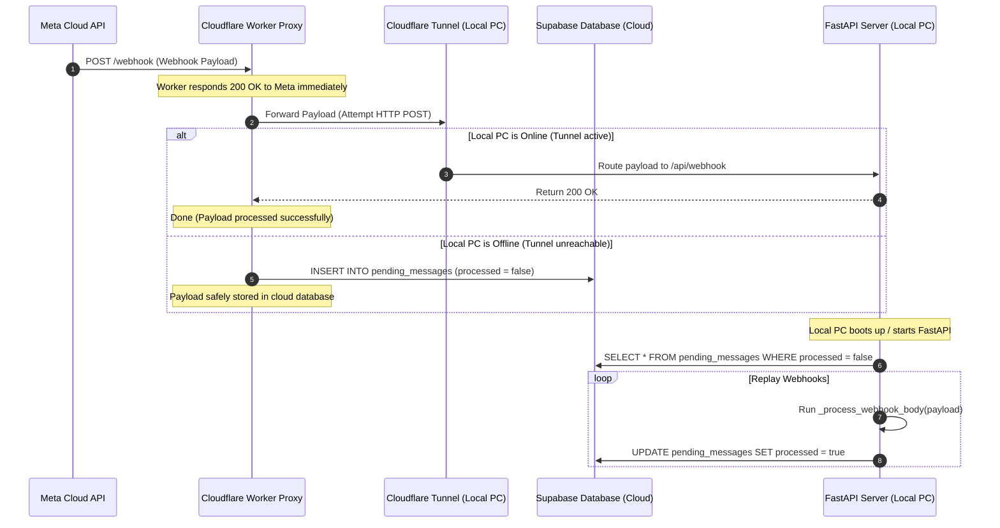

# ⚡ Caching, Concurrency, & Rate Limiting

This document outlines the performance optimizations, rate-limiting rules, concurrent task settings, caching logic, and offline message queue mechanisms built into **Black Angler**.

---

## 🔒 API Rate Limiting

To protect authentication endpoints from brute-force login attempts and prevent server resources from being overwhelmed, Black Angler uses **SlowAPI** (a Python port of the limits library) initialized in `python_backend/app/limiter.py`.

*   **Endpoint Configuration**:
    *   `POST /api/auth/login`: Rate-limited to **10 requests per minute** per client IP.
    *   `POST /api/auth/register`: Rate-limited to **5 requests per minute** per client IP.
*   **Implementation Detail**:
    The limiter uses the client's remote IP address (`get_remote_address`) as the unique identifier key. If a limit is exceeded, SlowAPI returns an HTTP `429 Too Many Requests` status code and raises a `RateLimitExceeded` exception, which is caught and formatted by FastAPI's custom exception handler.

---

## 🗄️ Redis Integration & Caching Layer

Redis serves three roles in the Black Angler infrastructure, helping handle task queues and pub/sub events.

### 1. Celery Task Queue Broker & Result Backend
Redis acts as the transportation broker (`redis://redis:6379/0`) between the FastAPI backend and the Celery background worker. 
*   **Broker**: Holds serialized campaign task payloads waiting for worker execution.
*   **Result Backend**: Stores completed campaign status metrics and metadata for up to **1 hour** (`result_expires=3600`), allowing the frontend to retrieve historical campaign data if needed.

### 2. Multi-Process Socket.IO Pub/Sub Broker
Because the FastAPI app and Celery worker run in separate Docker containers, the worker cannot access FastAPI's running Socket.IO memory space to send progress updates to clients.
*   To solve this, python-socketio uses a **Redis Pub/Sub channel manager**:
    ```python
    # Configured in celery tasks/broadcast_task.py
    socketio.AsyncRedisManager(REDIS_URL, write_only=True)
    ```
*   When the Celery worker updates a campaign's sending progress, it publishes the update to the Redis pub/sub channel.
*   The main FastAPI server listens to this channel and forwards the updates to the active client WebSocket room (`broadcasts`).

### 3. Chatbot Settings Memory Cache
To prevent querying MongoDB on every inbound customer message:
*   `services/bot_cache.py` caches the chatbot's configuration parameters (welcome message, business hours, interactive button values) in-memory.
*   When a manager updates the chatbot's settings via the dashboard, the cache is updated:
    ```python
    @router.post("/")
    async def update_bot_settings(data: BotSettingsUpdate, ...):
        # ... writes to MongoDB ...
        invalidate_cache() # Clears current cache, forcing next read to load fresh DB parameters
    ```

---

## ⚙️ Celery Concurrency & Workload Settings

The Celery worker settings in `celery_app.py` are optimized to run on standard client hardware (e.g. 8-16GB RAM PCs) and handle bulk broadcasts efficiently:

*   **`worker_concurrency=4`**: Limits the worker to **4 concurrent execution threads**, preventing CPU starvation on the host machine.
*   **`worker_max_memory_per_child=200_000`**: Restarts the worker process once it processes 200MB of tasks, preventing memory leaks from accumulating.
*   **`worker_prefetch_multiplier=1`**: Configures the worker to pull only **1 task at a time** from the Redis queue, preventing a single worker thread from hoarding tasks.
*   **`task_acks_late=True`**: Late acknowledgment ensures the worker only confirms task completion *after* the broadcast finishes. If the worker container crashes mid-broadcast, the task is preserved in Redis.
*   **`task_reject_on_worker_lost=True`**: If the execution thread crashes, the task is requeued and retried.

---

## 📥 Cloudflare Worker + Supabase Offline Webhook Queue

Since Black Angler is deployed on a local PC, the server goes offline when the computer is shut down (e.g. overnight or during power cuts). 

To prevent WhatsApp webhook messages (like customer replies or delivery receipts) from being lost, the system uses a Cloudflare Worker proxy and a Supabase queue.



### 1. Cloudflare Worker Ingress Filter (`worker.js`)
*   Receives Meta webhooks.
*   Immediately returns `200 EVENT_RECEIVED` to Meta to prevent delivery retries.
*   Attempts to forward the payload to the local FastAPI backend via the Cloudflare Tunnel URL.
*   If the local server is online (returns a 2xx status), the worker finishes.
*   If the local server is unreachable (PC is shut down or internet is down), the worker catches the error and writes the payload to a Supabase database table named `pending_messages` with `processed = false`.

### 2. Supabase Table Schema
The queue uses a single database table in the cloud:
*   `id`: Primary key UUID.
*   `payload`: JSON document containing the raw WhatsApp webhook payload.
*   `processed`: Boolean flag (defaulting to `false`).
*   `received_at`: Timestamp tracking when the webhook was caught.

### 3. Startup Catch-Up Routine (`message_poller.py`)
*   When the local FastAPI server starts up, its `lifespan` startup hook triggers the `catchup_missed_messages()` function.
*   This queries Supabase for all unprocessed messages:
    `GET /rest/v1/pending_messages?processed=eq.false&order=received_at.asc`
*   The backend loops through the fetched payloads in order (oldest first), processes them using the standard webhook handler, and marks each as processed:
    `PATCH /rest/v1/pending_messages?id=eq.{id}` with `{"processed": true}`.
*   This replays all missed messages and status updates to the local database, ensuring no customer communications are lost.
